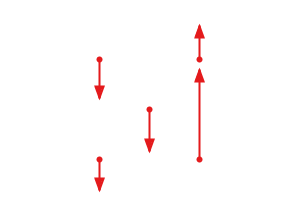
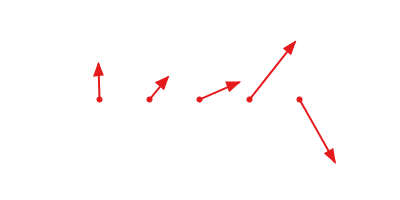
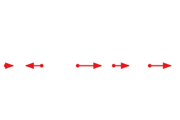
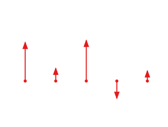
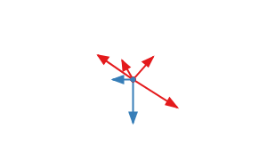
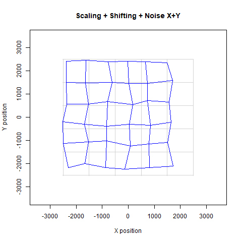

# Image Registration using Control Points

[](https://opensource.org/licenses/Apache-2.0) 

Image Registration API:

[](https://www.javadoc.io/doc/net.raumzeitfalle.registration/image-registration) [](https://search.maven.org/search?q=net.raumzeitfalle.registration) [](https://github.com/Oliver-Loeffler/image-registration/issues) [](https://sonarcloud.io/summary/new_code?id=net.raumzeitfalle.registration%3Aimage-registration)

Solver-API: 

[](https://www.javadoc.io/doc/net.raumzeitfalle.registration/solver-api)

## TL;DR;

Image registration is the process of finding the transform to match a given image with a desired reference. This library supports rigid body transforms (translation and rotation) as well as affine transforms (anisotropic scaling, anisotropic rotation/shear aka. non-orthogonality). Currently non-linear transforms are not supported.

Up to version 0.0.4, this API only worked together with NIST JAMA. Since version 0.0.5, different linear algebra frameworks can be used in `image-registration` using the Solver-API. Here it is now possible to choose either `gov.nist.math.jama`, 
`org.la4j`, `org.ejml`, `org.apache.commons.math3` or even `org.jblas`. The library now consists of an API and a core JAR and a group of JARs providing a solver implementation for the linear algebra framework of choice. 
The solver is selected using the Java SPI (Service Provider Interface) mechanism. With version 0.0.7, selection of a solver implementation is mandatory as the main artifact no longer includes a default solver implementation.

- [x] Versions up to and including 0.0.5 run with Java-8
- [x] Version 0.0.5 will support different linear algebra libraries (will make use of service provider API)
- [x] Version 0.0.6 will support ~~Java-8 and~~ Java-11 (~~utilize multi-release JARs~~ support for modules will be introduced)
- [x] Version 0.0.7 will no longer provide a bundle version, the core is now the `image-registration` API library. It will be mandatory to add the required solver as needed.
- [ ] Version 0.0.8 will support Java-17 with records (JEP 359)
- [ ] Later versions will support higher order calculations (first: up to 3rd order, 20 coefficient model)

These methods are used e.g. in photomask manufacturing, medical imaging or geospatial applications.
Control point or feature based methods have only limited scope of use in medical imaging, there intensity based or voxel based methods are preferred due to the natural structure of medical image data. These additional intensity and voxel based methods are not supported by this library.

* Photomask related:http://www.lithoguru.com/scientist/glossary/R.html#registration, http://www.lithoguru.com/scientist/glossary/O.html#overlay,  https://www.nist.gov/system/files/documents/pml/div683/conference/Hughes.pdf
* Medical imaging: http://www.iro.umontreal.ca/~sherknie/articles/medImageRegAnOverview/brussel_bvz.pdf
* Geo-Registration: http://www.georeference.org/doc/georegistration.htm 
* Chris A. Macks Youtube Channel: https://www.youtube.com/@ChrisMack

## How to start?

The SNAPSHOT-API documentation is available on: https://www.raumzeitfalle.net/image-registration/reg/
The javadoc for the Solver-API: https://www.raumzeitfalle.net/image-registration/solver/

Version 0.0.7 is available on Maven Central using following snippet:

### Maven Dependency for a project with JAMA backend (using `gov.nist.math:jama:1.0.3`):

```xml
<dependency>
  <groupId>net.raumzeitfalle.registration</groupId>
  <artifactId>image-registration</artifactId>
  <version>0.0.7</version>
</dependency>
<dependency>
  <groupId>net.raumzeitfalle.registration</groupId>
  <artifactId>jama-solver</artifactId>
  <version>0.0.7</version>
</dependency>
```

For a modular project, the projects module descriptor must be updated accordingly:

```java
module yourmodule {
	requires net.raumzeitfalle.registration.solver;
	requires net.raumzeitfalle.registration.core;
	uses net.raumzeitfalle.registration.solver.SolverProvider;
}
```

### Modular project with any custom backend:

```xml
<dependency>
  <groupId>net.raumzeitfalle.registration</groupId>
  <artifactId>solver-api</artifactId>
  <version>0.0.7</version>
</dependency>
<dependency>
  <groupId>net.raumzeitfalle.registration</groupId>
  <artifactId>la4j-solver</artifactId>
  <version>0.0.7</version>
</dependency>
```

The artifact `image-registration` provides the actual API for image registration using control points. The `solver-api` artifact defines the service provider interface which is required to integrate different externa linear algebra (LA) libraries. The third artifact in this example, `jama-solver` provides an implementation to the `solver-api` based on NIST JAMA library. 

When the consumer project requires a different LA library, the appropriate implementation provided by this project can be used.
In case a custom implementaton is required, this must be created based on `solver-api`.

### New API structure

| Module                      | Purpose                                                                                                                |
|-----------------------------|------------------------------------------------------------------------------------------------------------------------|
| `image-registration`        | Image Registration API without any external solver binding                                                             |
| `solver-api`                | API to utilize different linear algebra frameworks for calculation                                                     |
| `solver-test`               | Non-API, project to test numerics and service discovery of all available solvers                                       |
| `example-non-modular`       | Non-API, A Gradle example project on how to use this library in classical classpath based Java project aka. non-modular |
| `example-modular`           | Non-API, The same example project but implemented using the module path aka. a modular project.                        |
| `jama`                      | Non-API, Fork of NIST JAMA: Java Matrix Package, based on version 1.0.3                                                |

### Following solver implementations will be available

| Solver Module         | Dependency to:                                                                    | Library version: |
|-----------------------|-----------------------------------------------------------------------------------|-|
| `apache-math3-solver` | `org.apache.commons:commons-math3`                                                | 3.6.1 |
| `ejml-solver`         | `org.ejml:ejml-simple`                                                            | 0.41 |
| `jama-solver`         | `gov.nist.math:jama`                                                              | 1.0.3 |
| `jblas-solver`        | `org.jblas:jblas`                                                                 | 1.2.5 |
| `la4j-solver`         | `org.la4j:la4j`                                                                   | 0.6.0 |
| `jama`                | no external dependency, functionality is equivalent to `gov.nist.math:jama:1.0.3` | 0.6.0 |

### More Linear Algebra libraries:

* https://ojalgo.org/
* https://dst.lbl.gov/ACSSoftware/colt/
* https://github.com/fommil/matrix-toolkits-java
* https://github.com/deeplearning4j/nd4j
* https://math.nist.gov/javanumerics/jama/


## Goals

- [ ] Learn how to implement a construction kit for various transforms used in photomask image placement 
  using Javas functional elements (enabling use of .andThen(...) and .compose(...)
- [ ]  Experimenting to find suitable data types and data flows for easy use and extendability
- [ ]  Try to make model parameter names and class names to speak for themselves, ideally 
  end up with a fluent API which uses builder pattern for setup
- [ ]  The library should behave as lazy as possible 
- [ ]  It should be numerically and technically correct 
- [ ]  Try more advanced transforms beyond rigid (alignment) and affine (6-parameter first 
  order). Technically n-parameters higher order should work.
- [x]  Decouple matrix computation (equation solving) from high level transform code so 
  that matrix libraries can be exchanged (e.g. using La4J instead of Jama)
- [ ]  Make all core elements immutable, improve design step by step to achieve concurrency 
  for large data sets (improve speed by using fork-join, try to use async using CompletableFutures) 
- [ ]  Consider use of Units-of-Measurement API (JSR385, http://unitsofmeasurement.github.io/unit-api/)
- [ ]  Utilize records where possible (JEP359, https://openjdk.java.net/jeps/359)

## Todos

* Handle 1D cases (handling of individual missing points already works)
* Define high level API (ideally fluent or builder based) to compose evaluations.
* Fluent-API for selecting specific displacements for alignment, positional calculation, 
  first order calculation
* Implement higher order polynomial model with configurable coefficients (polynomial 
  model should work up to 9th order, coefficients to be used shall be configurable independently for x and y)
* Sum up learnings and reshape structure of alignment/correction classes, possibly add 
  higher level functions to do the all-in-one-job as its done in the demos.
* Add graphical examples of first order distortions.
* Functionality to determine which kind of correction / model can be used on a given dataset

# How does is work?

## Processing steps


## Concepts

* Image registration
* Displacement
* Rigid Body Transform
* Affine Transform
* Alignment and First Order Distortions
* FirstOrderSetup
* FirstOrderCorrection
* FirstOrderResult

## Domain types

* Displacement

* Category
* SiteSelection
    * AlignmentSelection
    * CalculationSelection

* Transform (high level)
    * RigidTransform
    * AffineTransform
    * SimilarityTransform
    * NonUniformSimilarityTransform
    * HighOrderTransform (not yet implemented)
      
* TransformCorrection
    * SkipTransform
    * SkippableOperation

* Transform (low level)
    * ModelEquation
    * TransformModel
    * Dimension
    * Orientation
    * SpatialDistribution
    * Distribution

## Interfaces

### Transforms

Transforms are used to manipulate displacement elements. Depending on the model used, 
there may exist different transform types and implementations. Each transform is a 
`Function` which, applied to a `Displacement`, will return a `Displacement`. There 
are currently two base transforms, the `RigidTransform` and the `AffineTransform`. 
When transforms are parameterized in a way that there will be actually no change to 
the displacement data, then in some cases a `SkipTransform` might be created and used. 
A `SkipTransform` must not perform any calculations, instead it must pass through the 
given data without any modifications.


### Transform Models

One idea and goal is, to make the underlying transformation models exchangeable. Therefore 
the `RigidBodyModel` and the `AffineModel` interfaces exist. The idea is to make the 
actual calculation algorithm exchangeable whereas the code used in an applications 
shall remain unchanged.
The models are technically bi-functions which consume a `Collection` of equation objects 
(`<T extends Orientable>`) and a `Dimension` instance. The `Dimension` instance holds the
information how many X,Y locations exist and how the data is oriented (e.g. 1D one-dimensional, 
either X or Y or 2D two-dimensional X and Y). Using the equations and the dimensional 
information any kind or matrix based system can be configured.


# Examples (see example-modular)

There are some demos available, how this library is supposed to be used:

* `net/raumzeitfalle/registration/examples/modular/DemoFourpointsOnlyWithMissingMeas.java`
* `net/raumzeitfalle/registration/examples/modular/DemoFourpointsScanner.java`
* `net/raumzeitfalle/registration/examples/modular/DemoFourpointsStandard.java`
* `net/raumzeitfalle/registration/examples/modular/DemoMultipoint.java`
* `net/raumzeitfalle/registration/examples/modular/DemoMultipointMagnification.java`
* `net/raumzeitfalle/registration/examples/modular/DemoMultipointOneDimensional.java` (not yet validated)
* `net/raumzeitfalle/registration/examples/modular/DemoMultipointResidual.java`

The class `net.raumzeitfalle.registration.examples.modular.Demo` is used to define all examples. This template allows it, to configure and parameterize the evaluation process as needed. 

The following example code shows, how alignment on 4 selected locations works, with 
info only locations being removed. First order (scale/ortho) will be calculated on 
all locations. To calculate first order on selected locations, `Alignments.SCANNER_SELECTED` must 
be used.

```java
    
    /* STEP 1, load displacements from file (or any other source)
     *
     * The CSV file may look like:
     * "refx","refy","posx","posy","diffx","diffy","type"
     * 10980.0,9012.5,10980.014331404400,9012.481628831100,0.014331404400,-0.018371168900,"ALIGN"
     * 10980.0,73512.5,10980.009388937700,73512.484174799200,0.009388937700,-0.015825200800,"REG_MARK"
     * 10980.0,143387.5,10980.004598393400,143387.490394277000,0.004598393400,-0.009605722700,"ALIGN"
     * ....
     * 146975.0,14925.0,146975.030283248000,NaN,0.030283248900,NaN,"INFO_ONLY"
     * 
     * All values are stored with the same unit, in this example all columns consist
     * of values in microns. The values in columns (diffx,diffy) are not used.
     * In case of one-dimensionality or missing values, NaN can be used.
     * 
     */

    List<Displacement> displacements = new FileLoader().load(Paths.get("Demo-4Point.csv"));
        
    /*
     * 
     * Each Displacement consists of a design location (x,y) and the actual displaced
     * location (xd,yd). By default, each Displacement is of type REG, but depending
     * on declaration in CSV file, a different DisplacementClass can be assigned.
     * The DisplacementClass allows to create simple predicates to select Displacmemt  
     * instances for different operations.
     *
     */
    

    // STEP 2, perform site selection
    Predicate<Displacement> allSites = d->true;
     
    SiteSelection selection = SiteSelection
                        .forAlignment(d -> d.isOfType(DisplacementClass.ALIGN))
                        .forCalculation(allSites)
                        .forRemoval(d->d.isOfType(DisplacementClass.INFO_ONLY));
    
    // STEP 3, parametrize evaluation model 
    FirstOrderSetup setup = FirstOrderSetup
                        .usingAlignment(Alignments.SELECTED)
                        .withCompensations(Compensations.SCALE, Compensations.ORTHO)
                        .withSiteSelection(selection);

    // STEP 4, perform correction and calculate results
    FirstOrderResult result = FirstOrderCorrection.using(displacements, setup);
    Collection<Displacement> results = result.getDisplacements();

    /* 
     *  Alternatively:
     *
     *  FirstOrderCorrection correction = new FirstOrderCorrection();
     *  results = correction.apply(displacements, setup).getDisplacements();
     * 
     *  As FirstOrderCorrection is a function, .andThen(...) and .compose(...) 
     *  can be used as well. 
     *
     */  
    
    // STEP 5, print results
        
    // Now print results before correction
    DisplacementSummary uncorrectedSummary = Displacement.summarize(displacements, selection.getCalculation());
    System.out.println(uncorrectedSummary);
        
    // after correction
    DisplacementSummary correctedSummary = Displacement.summarize(results, selection.getCalculation());
    System.out.println(correctedSummary);
        
    // now also print residual first order and alignment
    RigidTransform correctedAlignment = result.getAlignment();
    System.out.println(correctedAlignment);
        
    AffineTransform correctedFirstOrder = result.getFirstOrder();
    System.out.println(correctedFirstOrder);
```

## Transform types

| Symbol | Description                                                      |
| ------ | ---------------------------------------------------------------- |
|    +   | is directly calculated by model                                  |
|    o   | can be approximated from results                                 |
|  sx/sy | anisotropic scaling (scale x/y)                                  |
|   mag  | magnification, isotropic scaling (mag = average(sx,sy))          |
|  ox/oy | anisotropic rotation (shearing or non-orthogonality, ortho x/y)  |
|  ortho | isotropic non-orthogonality (ortho = oy - ox)                    |
|   rot  | isotropic rotation                                               |
|  tx/ty | translation in x/y direction                                     |


| Transform              | tx  | ty  | sx  | sy  | mag | ox  | oy  | ortho | rot |
| ---------------------- | --- | --- | --- | --- | --- | --- | --- | ----- | --- |
| Rigid                  | +   | +   |     |     |     |     |     |       |  +  |
| Affine                 | +   | +   | +   | +   | o   | +   | +   | +     |  o  |
| Similarity             | +   | +   |     |     | +   |     |     | o     |  +  |
| Non-Uniform Similarity | +   | +   | +   | +   | o   |     |     | o     |  +  |


## Cases

### #1 common case, references and readings in 2D (X,Y)


| Direction | Refs | Readings |
| --------- | -----| -------- |
| X (count) | > 1  | > 1      |
| Y (count) | > 1  | > 1      |

* Input: X,Y,Xd,Yd
* Result: tx,ty,sx,sy,ox,oy

### #2 special case, references 2D, readings 1D (X)


| Direction | Refs | Readings |
| --------- | -----| -------- |
| X (count) | > 1  | > 1      |
| Y (count) | > 1  | = 0      |

* Input: X,Y,Xd
* Result: tx,sx,ox

### #3 special case, references 2D, readings 1D (Y)



| Direction | Refs | Readings |
| --------- | -----| -------- |
| X (count) | > 1  | = 0      |
| Y (count) | > 1  | > 1      |

* Input: X,Y,Yd
* Result: ty,sy,oy

### #4 common case, references in 2D, most readings (X,Y), *some readings (X or Y)*


| Direction | Refs | Readings |
| --------- | -----| -------- |
| X (count) | > 1  | > 1      |
| Y (count) | > 1  | > 1      |

* Input: X,Y,Xd,Yd; __*some readings have either Xd or Yd only*__
* Result: tx,ty,sx,sy,ox,oy

### #5 special case, references along horizontal line, readings in 2D (X,Y)



| Direction | Refs | Readings |
| --------- | -----| -------- |
| X (count) | > 1  | > 1      |
| Y (count) | = 1  | > 1      |

* Input: X,Y,Xd,Yd
* Result: tx,ty,sx,ox

### #6 special case, references along vertical line, readings in 2D (X,Y)


| Direction | Refs | Readings |
| --------- | -----| -------- |
| X (count) | = 1  | > 1      |
| Y (count) | > 1  | > 1      |

* Input: X,Y,Xd,Yd
* Result: tx,ty,sy,oy

### #7 special case, references along horizontal line, readings in 1D (X)



| Direction | Refs | Readings |
| --------- | -----| -------- |
| X (count) | > 1  | > 1      |
| Y (count) | = 1  | = 0      |

* Input: X,Y,Xd
* Result: tx,sx

### #8 special case, references along horizontal line, readings in 1D (Y)



| Direction | Refs | Readings |
| --------- | -----| -------- |
| X (count) | > 1  | = 0      |
| Y (count) | = 1  | > 1      |

* Input: X,Y,Yd
* Result: ty,ox

### #9 special case, references along vertical line, readings in 1D (X)
### #10 special case, references along vertical line, readings in 1D (Y)
### #11 special case, only one reference position, readings in (X and Y) or (X or Y)



## Distortion Types Overview (incomplete)

### Noise and No-Noise


### Translation


### Scaling


### Skew


### Combination





### Higher Order


# References for further reading

## Links

* https://www.fil.ion.ucl.ac.uk/spm/doc/books/hbf2/pdfs/Ch2.pdf
* https://www.uni-muenster.de/AMM/num/Vorlesungen/VarBioMed_WS10/skript/Kapitel_3_4_Registrierung.pdf
* http://www.mathe.tu-freiberg.de/~tochten/gkhm/skript_Matrizen_Gleichungssysteme_Determinanten_ws07.pdf
* https://www.cs.tau.ac.il/~dcor/Graphics/cg-slides/trans3d.pdf 

# License

## Apache License, Version 2.0 

Copyright 2019 Oliver Löffler, Raumzeitfalle.net

Licensed under the Apache License, Version 2.0 (the "License");
you may not use this file except in compliance with the License.
You may obtain a copy of the License at

   http://www.apache.org/licenses/LICENSE-2.0

Unless required by applicable law or agreed to in writing, software
distributed under the License is distributed on an "AS IS" BASIS,
WITHOUT WARRANTIES OR CONDITIONS OF ANY KIND, either express or implied.
See the License for the specific language governing permissions and
limitations under the License.

## Attributions, external libraries used with their licenses

This project makes use of NIST.gov JAMA library. JAMA is public domain, see:
https://math.nist.gov/javanumerics/jama/#license.

Also, this project uses LA4J library, which also follows Apache 2.0 license.
See http://la4j.org for details, sources can be found at https://github.com/vkostyukov/la4j.

Badges have been created with:

* https://www.javadoc.io
* https://shields.io
