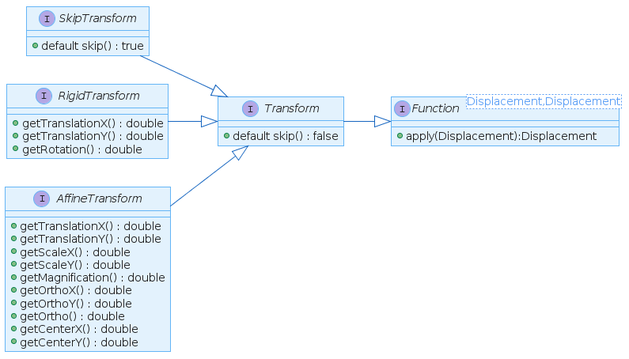

# Image Registration using Control Points

[](https://opensource.org/licenses/Apache-2.0) [](https://www.javadoc.io/doc/net.raumzeitfalle.registration/image-registration) [](https://travis-ci.org/Oliver-Loeffler/image-registration) [](https://sonarcloud.io/dashboard?id=net.raumzeitfalle.registration%3Aimage-registration) 
[](https://codecov.io/gh/Oliver-Loeffler/image-registration) [](https://maven-badges.herokuapp.com/maven-central/net.raumzeitfalle.registration/image-registration)

## TL;DR;

Image registration is the process of finding the transform to match a given image with a desired reference. This library supports rigid body transforms (translation and rotation) as well as affine transforms (anisotropic scaling, anisotropic rotation/shear aka. non-orthogonality). Currently non-linear transforms are not supported.

Version 0.0.5 will introduce a method to select different linear algebra frameworks to 
be used in `image-registration`. Here it will be possible to choose either `gov.nist.math.jama`, 
`org.la4j`, `org.ejml`, `org.apache.commons.math3` or even `org.jblas`. There will be a core or api JAR 
for `image-registration` and there will be a group of JARs providing a solver implementation. 
The solver will be selected using the Java SPI (Service Provider Interface) mechanism. 

* Versions up to and including 0.0.5 run with Java-8
* Version 0.0.5 will support different linear algebra libraries (will make use of service provider API)
* Version 0.0.6 will support Java-8 and Java-11 (utilize multi-release JARs)
* Version 0.0.8 will support Java-15 with records
* Later versions will support higher order calculations (first: up to 3rd order, 20 coefficient model)

These methods are used e.g. in photomask manufacturing, medical imaging or geospatial applications.
Control point or feature based methods have only limited scope of use in medical imaging, there intensity based or voxel based methods are preferred due to the natural structure of medical image data. These additional intensity and voxel based methods are not supported by this library.

* Photomask related:http://www.lithoguru.com/scientist/glossary/R.html#registration, http://www.lithoguru.com/scientist/glossary/O.html#overlay,  https://www.nist.gov/system/files/documents/pml/div683/conference/Hughes.pdf
* Medical imaging: http://www.iro.umontreal.ca/~sherknie/articles/medImageRegAnOverview/brussel_bvz.pdf
* Geo-Registration: http://www.georeference.org/doc/georegistration.htm 

## How to start?

The SNAPSHOT-API documentation is available on: https://www.raumzeitfalle.net/image-registration/api/
Version 0.0.4 is available on Maven Central using following snippet:
Version 0.0.5 will be ready until end of April'2021.


```xml
<dependency>
  <groupId>net.raumzeitfalle.registration</groupId>
  <artifactId>image-registration</artifactId>
  <version>0.0.4</version>
</dependency>
```

For version 0.0.5 the setup will look different. Starting with 0.0.5, there will be a separated Solver-API, the actual image-registration API and a dependency to a Solver-implementation. The plan is, to provide following solver implementations:

### New API structure

| Module | Purpose |
|-|-|
| `core-api`   | Image Registration API |
| `solver-api` | API to utilize different linear algebra frameworks for calculation |
| `image-registration` | A convenience package where a JAMA-based solver is included. When the consumer project utilizes a different linear algebra library, the appropriate solver module can be used instead.|

### Following solver implementations will be available

| Solver Module | Dependency to: |
|-|-|
| `apache-math3-solver` | `org.apache.commons:commons-math3` |
| `ejml-solver`        |  `org.ejml:ejml-simple` |
| `jama-solver`        | `gov.nist.math:jama` |
| `jblas-solver`       | `org.jblas:jblas` |
| `la4j-solver`        | `org.la4j:la4j` |

### More Linear Algebra libraries:
* https://ojalgo.org/
* https://dst.lbl.gov/ACSSoftware/colt/
* https://github.com/fommil/matrix-toolkits-java
* https://github.com/deeplearning4j/nd4j


## Goals

* Learn how to implement a construction kit for various transforms used in photomask image placement 
  using Javas functional elements (enabling use of .andThen(...) and .compose(...)
* Experimenting to find suitable data types and data flows for easy use and extendability
* Try to make model parameter names and class names to speak for them selves, ideally 
  end up with a fluent API which uses builder pattern for setup
* The library should behave as lazy as possible 
* It should be numerically and technically correct 
* Try more advanced transforms beyond rigid (alignment) and affine (6-parameter first 
  order). Technically n-parameters higher order should work.
* Decouple matrix computation (equation solving) from high level transform code so 
  that matrix libraries can be exchanged (e.g. using La4J instead of Jama)
* Make all core elements immutable, improve design step by step to achieve concurrency 
  for large data sets (improve speed by using fork-join, try to use async using CompletableFutures) 
* Consider use of Units-of-Measurement API (JSR385, http://unitsofmeasurement.github.io/unit-api/)
* Learn how project Valhalla works in Java 14 (JEP169, https://openjdk.java.net/jeps/169)

## Todos
* Handle 1D cases (handling of individual missing points already works)
* Define high level API (ideally fluent or builder based) to compose evaluations.
* Fluent-API for selecting specific displacements for alignment, positional calculation, 
  first order calculation

* Implement higher order polynomial model with configurable coefficients (polynomial 
  model should work up to 9th order, coefficients to be used shall be configurable independently for x and y)
* Sum up learnings and reshape structure of alignment/correction classes, possibly add 
  higher level functions to do the all-in-one-job as its done in the demos.   

* Create a multi-release JAR where Java-8 and Java-11 are supported
* Move to Java 11 and introduce modules
* Move to Java 15 and introduce records

* Add graphical examples of first order distortions.

# How does is work?

## Processing steps


## Concepts

* Image registration
* Displacement
* Rigid Body Transform
* Affine Transform
* Alignment and First Order Distortions

* FirstOrderSetup
* FirstOrderCorrection
* FirstOrderResult

## Domain types

* Displacement

* Category

* SiteSelection
    * AlignmentSelection
    * CalculationSelection

* Transform (high level)
    * RigidTransform
    * AffineTransform
    * SimilarityTransform
    * NonUniformSimilarityTransform
    * HighOrderTransform (not yet implemented)
      
* TransformCorrection
    * SkipTransform
    * SkippableOperation

* Transform (low level)
    * ModelEquation
    * TransformModel
    * Dimension
    * Orientation
    * SpatialDistribution
    * Distribution

## Interfaces

### Transforms

Transforms are used to manipulate displacement elements. Depending on the model used, 
there may exist different transform types and implementations. Each transform is a 
`Function` which, applied to a `Displacement`, will return a `Displacement`. There 
are currently two base transforms, the `RigidTransform` and the `AffineTransform`. 
When transforms are parameterized in a way that there will be actually no change to 
the displacement data, then in some cases a `SkipTransform` might be created and used. 
A `SkipTransform` must not perform any calculations, instead it must pass through the 
given data without any modifications.



### Transform Models

One idea and goal is, to make the underlying transformation models exchangeable. Therefore 
the `RigidBodyModel` and the `AffineModel` interfaces exist. The idea is to make the 
actual calculation algorithm exchangeable whereas the code used in an applications 
shall remain unchanged.
The models are technically bi-functions which consume a `Collection` of equation objects 
(`<T extends Orientable>`) and a `Dimension` instance. The `Dimension` instance holds the
information how many X,Y locations exist and how the data is oriented (e.g. 1D one-dimensional, 
either X or Y or 2D two-dimensional X and Y). Using the equations and the dimensional 
information any kind or matrix based system can be configured.


# Examples

There are some demos available, how this library is supposed to be used:

* `net/raumzeitfalle/registration/examples/DemoFourpointsOnlyWithMissingMeas.java`
* `net/raumzeitfalle/registration/examples/DemoFourpointsScanner.java`
* `net/raumzeitfalle/registration/examples/DemoFourpointsStandard.java`
* `net/raumzeitfalle/registration/examples/DemoMultipoint.java`
* `net/raumzeitfalle/registration/examples/DemoMultipointMagnification.java`
* `net/raumzeitfalle/registration/examples/DemoMultipointOneDimensional.java` (not yet validated)
* `net/raumzeitfalle/registration/examples/DemoMultipointResidual.java`

The class `net.raumzeitfalle.registration.examples.Demo` is used to define all examples. This template allows it, to configure and parameterize the evaluation process as needed. 

The following example code shows, how alignment on 4 selected locations works, with 
info only locations being removed. First order (scale/ortho) will be calculated on 
all locations. To calculate first order on selected locations, `Alignments.SCANNER_SELECTED` must 
be used.

```java
    
    /* STEP 1, load displacements from file (or any other source)
     *
     * The CSV file may look like:
     * "refx","refy","posx","posy","diffx","diffy","type"
     * 10980.0,9012.5,10980.014331404400,9012.481628831100,0.014331404400,-0.018371168900,"ALIGN"
     * 10980.0,73512.5,10980.009388937700,73512.484174799200,0.009388937700,-0.015825200800,"REG_MARK"
     * 10980.0,143387.5,10980.004598393400,143387.490394277000,0.004598393400,-0.009605722700,"ALIGN"
     * ....
     * 146975.0,14925.0,146975.030283248000,NaN,0.030283248900,NaN,"INFO_ONLY"
     * 
     * All values are stored with the same unit, in this example all columns consist
     * of values in microns. The values in columns (diffx,diffy) are not used.
     * In case of one-dimensionality or missing values, NaN can be used.
     * 
     */

    List<Displacement> displacements = new FileLoader().load(Paths.get("Demo-4Point.csv"));
        
    /*
     * 
     * Each Displacement consists of a design location (x,y) and the actual displaced
     * location (xd,yd). By default, each Displacement is of type REG, but depending
     * on declaration in CSV file, a different DisplacementClass can be assigned.
     * The DisplacementClass allows to create simple predicates to select Displacmemt  
     * instances for different operations.
     *
     */
    

    // STEP 2, perform site selection
    Predicate<Displacement> allSites = d->true;
     
    SiteSelection selection = SiteSelection
                        .forAlignment(d -> d.isOfType(DisplacementClass.ALIGN))
                        .forCalculation(allSites)
                        .forRemoval(d->d.isOfType(DisplacementClass.INFO_ONLY));
    
    // STEP 3, parametrize evaluation model 
    FirstOrderSetup setup = FirstOrderSetup
                        .usingAlignment(Alignments.SELECTED)
                        .withCompensations(Compensations.SCALE, Compensations.ORTHO)
                        .withSiteSelection(selection);

    // STEP 4, perform correction and calculate results
    FirstOrderResult result = FirstOrderCorrection.using(displacements, setup);
    Collection<Displacement> results = result.getDisplacements();

    /* 
     *  Alternatively:
     *
     *  FirstOrderCorrection correction = new FirstOrderCorrection();
     *  results = correction.apply(displacements, setup).getDisplacements();
     * 
     *  As FirstOrderCorrection is a function, .andThen(...) and .compose(...) 
     *  can be used as well. 
     *
     */  
    
    // STEP 5, print results
        
    // Now print results before correction
    DisplacementSummary uncorrectedSummary = Displacement.summarize(displacements, selection.getCalculation());
    System.out.println(uncorrectedSummary);
        
    // after correction
    DisplacementSummary correctedSummary = Displacement.summarize(results, selection.getCalculation());
    System.out.println(correctedSummary);
        
    // now also print residual first order and alignment
    RigidTransform correctedAlignment = result.getAlignment();
    System.out.println(correctedAlignment);
        
    AffineTransform correctedFirstOrder = result.getFirstOrder();
    System.out.println(correctedFirstOrder);
```

# References for further reading

## Links

* https://www.fil.ion.ucl.ac.uk/spm/doc/books/hbf2/pdfs/Ch2.pdf
* https://www.uni-muenster.de/AMM/num/Vorlesungen/VarBioMed_WS10/skript/Kapitel_3_4_Registrierung.pdf
* http://www.mathe.tu-freiberg.de/~tochten/gkhm/skript_Matrizen_Gleichungssysteme_Determinanten_ws07.pdf
* https://www.cs.tau.ac.il/~dcor/Graphics/cg-slides/trans3d.pdf 

# License

## Apache License, Version 2.0 

   Copyright 2019 Oliver Löffler, Raumzeitfalle.net

   Licensed under the Apache License, Version 2.0 (the "License");
   you may not use this file except in compliance with the License.
   You may obtain a copy of the License at

       http://www.apache.org/licenses/LICENSE-2.0

   Unless required by applicable law or agreed to in writing, software
   distributed under the License is distributed on an "AS IS" BASIS,
   WITHOUT WARRANTIES OR CONDITIONS OF ANY KIND, either express or implied.
   See the License for the specific language governing permissions and
   limitations under the License.

## Attributions, external libraries used with their licenses

   This project makes use of NIST.gov JAMA library. JAMA is public domain, see:
   https://math.nist.gov/javanumerics/jama/#license.

   Also this project uses LA4J library, which also follows Apache 2.0 license.
   See http://la4j.org for details, sources can be found at https://github.com/vkostyukov/la4j.

 
