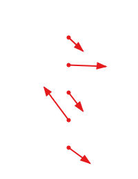

## Transform types

| Symbol | Description                                                      |
| ------ | ---------------------------------------------------------------- |
|    +   | is directly calculated by model                                  |
|    o   | can be approximated from results                                 |
|  sx/sy | anisotropic scaling (scale x/y)                                  |
|   mag  | magnification, isotropic scaling (mag = average(sx,sy))          |
|  ox/oy | anisotropic rotation (shearing or non-orthogonality, ortho x/y)  |
|  ortho | isotropic non-orthogonality (ortho = oy - ox)                    |
|   rot  | isotropic rotation                                               |
|  tx/ty | translation in x/y direction                                     |

| Transform              | tx  | ty  | sx  | sy  | mag | ox  | oy  | ortho | rot |
| ---------------------- | --- | --- | --- | --- | --- | --- | --- | ----- | --- |
| Rigid                  | +   | +   |     |     |     |     |     |       |  +  |
| Affine                 | +   | +   | +   | +   | o   | +   | +   | +     |  o  |
| Similarity             | +   | +   |     |     | +   |     |     | o     |  +  |
| Non-Uniform Similarity | +   | +   | +   | +   | o   |     |     | o     |  +  |

## Cases

### #1 common case, references and readings in 2D (X,Y)

| Direction | Refs | Readings |
| --------- | -----| -------- |
| X (count) | > 1  | > 1      |
| Y (count) | > 1  | > 1      |

* Input: X,Y,Xd,Yd
* Result: tx,ty,sx,sy,ox,oy

### #2 special case, references 2D, readings 1D (X)

| Direction | Refs | Readings |
| --------- | -----| -------- |
| X (count) | > 1  | > 1      |
| Y (count) | > 1  | = 0      |

* Input: X,Y,Xd
* Result: tx,sx,ox

### #3 special case, references 2D, readings 1D (Y)

| Direction | Refs | Readings |
| --------- | -----| -------- |
| X (count) | > 1  | = 0      |
| Y (count) | > 1  | > 1      |

* Input: X,Y,Yd
* Result: ty,sy,oy

### #4 common case, references in 2D, most readings (X,Y), *some readings (X or Y)*

| Direction | Refs | Readings |
| --------- | -----| -------- |
| X (count) | > 1  | > 1      |
| Y (count) | > 1  | > 1      |

* Input: X,Y,Xd,Yd; __*some readings have either Xd or Yd only*__
* Result: tx,ty,sx,sy,ox,oy

### #5 special case, references along horizontal line, readings in 2D (X,Y)

| Direction | Refs | Readings |
| --------- | -----| -------- |
| X (count) | > 1  | > 1      |
| Y (count) | = 1  | > 1      |

* Input: X,Y,Xd,Yd
* Result: tx,ty,sx,ox

### #6 special case, references along vertical line, readings in 2D (X,Y)

| Direction | Refs | Readings |
| --------- | -----| -------- |
| X (count) | = 1  | > 1      |
| Y (count) | > 1  | > 1      |

* Input: X,Y,Xd,Yd
* Result: tx,ty,sy,oy

### #7 special case, references along horizontal line, readings in 1D (X)

| Direction | Refs | Readings |
| --------- | -----| -------- |
| X (count) | > 1  | > 1      |
| Y (count) | = 1  | = 0      |

* Input: X,Y,Xd
* Result: tx,sx

### #8 special case, references along horizontal line, readings in 1D (Y)

| Direction | Refs | Readings |
| --------- | -----| -------- |
| X (count) | > 1  | = 0      |
| Y (count) | = 1  | > 1      |

* Input: X,Y,Yd
* Result: ty,ox

### #9 special case, references along vertical line, readings in 1D (X)
### #10 special case, references along vertical line, readings in 1D (Y)
### #11 special case, only one reference position, readings in (X and Y) or (X or Y)

